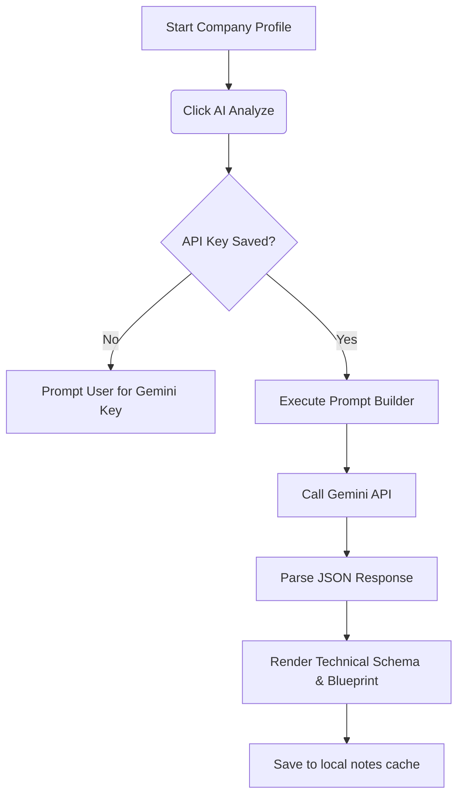

# Proposal: Future Features for YC Idea Explorer

This document proposes new feature modules that can transform the YC Idea Explorer from a passive startup directory into an active **Idea Incubator & Builder Workspace**.

---

## 1. Feature Map & Value Matrix

| Feature Module | Development Cost | Learning Value | Why it is Crucial |
| :--- | :--- | :--- | :--- |
| **A. Builder's Sandbox & Kanban Board** | Medium | High | Bridges the gap between reading reference ideas and structuring your own active builds. |
| **B. AI Tech Spec & Schema Generator** | Low-Medium | High | Translates high-level descriptions into actual technical specs (Database schemas, API routes) for developers. |
| **C. Tech Stack Directory** | Medium | Medium | Helps builders see which technologies (e.g. Rails, Node, Postgres) are popular in specific business models. |
| **D. Historical Trend Visualizer** | Low-Medium | Medium | Displays industry saturation charts and macro VC direction shifts over the last 15 years. |
| **E. Fuzzy / Semantic Search** | Low | High | Enables typo-tolerant, ranked, and relevant searching across description paragraphs. |

---

## 2. In-Depth Feature Architecture

### Feature A: Builder's Sandbox & Kanban Board
This turns the explorer into a planning tool. It allows you to brainstorm your own products alongside YC references.

- **The Concept:** A new "Sandbox" workspace tab.
- **Workflow:**
  1. Create a "My Idea" draft (e.g. *AutoDraft - AI Lawyer*).
  2. Drag and drop YC startup cards (e.g., *Harvey AI*, *Draftwise*) into a "References & Inspiration" bucket on your idea card.
  3. Write down your custom feature comparison, target customer profile, and database design.
- **State & Persistence:** Stored locally in `localStorage` under `yc_sandbox_projects` and bundled automatically into the export/import JSON backup.

---

### Feature B: AI Tech Spec & Database Schema Generator
This is an automated learning assistant that converts raw startup descriptions into a concrete software development blueprint.

- **The Concept:** Clicking "Analyze Startup" opens an AI console inside the Inspector.
- **Integration:** Uses the official client-side Gemini API SDK (or a lightweight local endpoint). The user provides their own Gemini API Key in an encrypted settings panel.
- **Outputs generated:**
  - **Database Schema:** A suggested SQL/Prisma database schema with tables, columns, and relations.
  - **Core API Routes:** A list of Node/Express API routes (REST or GraphQL) needed to execute the core service.
  - **Suggested Third-Party APIs:** Which APIs (e.g., Stripe, Twilio, OpenAI, Pinecone) are required to build the product.

---

### Feature C: Filter Startups by Tech Stack
YC startup listings usually outline their primary technologies. We can compile and filter based on these stacks.

- **The Concept:** Search filters that let you select: *"Backend: Python"*, *"Frontend: React"*, *"Database: Postgres"*.
- **Implementation:** 
  - Scan tag variables and description texts for popular keywords (e.g., *Django, Ruby on Rails, Node.js, NextJS, Serverless, Docker, PyTorch*).
  - Categorize them into lists.
  - Allow users to filter the list to only show startups built with their target tech stacks.

---

### Feature D: Interactive Trends & Saturation Visualizer
An analysis portal that shows visual charts of historical startup batches.

- **The Concept:** An interactive dashboard using a simple, lightweight charting library (like `Recharts` or pure Tailwind bar graphs).
- **Available Charts:**
  - **Funding by Industry over Years:** Visualizes how sectors rise and fall (e.g., the massive spike in GenAI starting in 2023 vs. the decline in Web3).
  - **Active vs. Acquired vs. Inactive Ratio:** Shows the survival rate of different industries in YC history.
  - **Average Team Sizes:** A distribution curve of YC startup employee size.

---

## 3. Recommended Roadmap

1.  **Phase 1 (Search & Relevance):** Integrate `Fuse.js` for typo-tolerant fuzzy search.
2.  **Phase 2 (Project Sandbox):** Build the Kanban board / Sandbox project planner, allowing you to associate YC references to your own ideas.
3.  **Phase 3 (AI integration):** Integrate client-side Gemini prompts for SQL schema generation and product blueprints.
